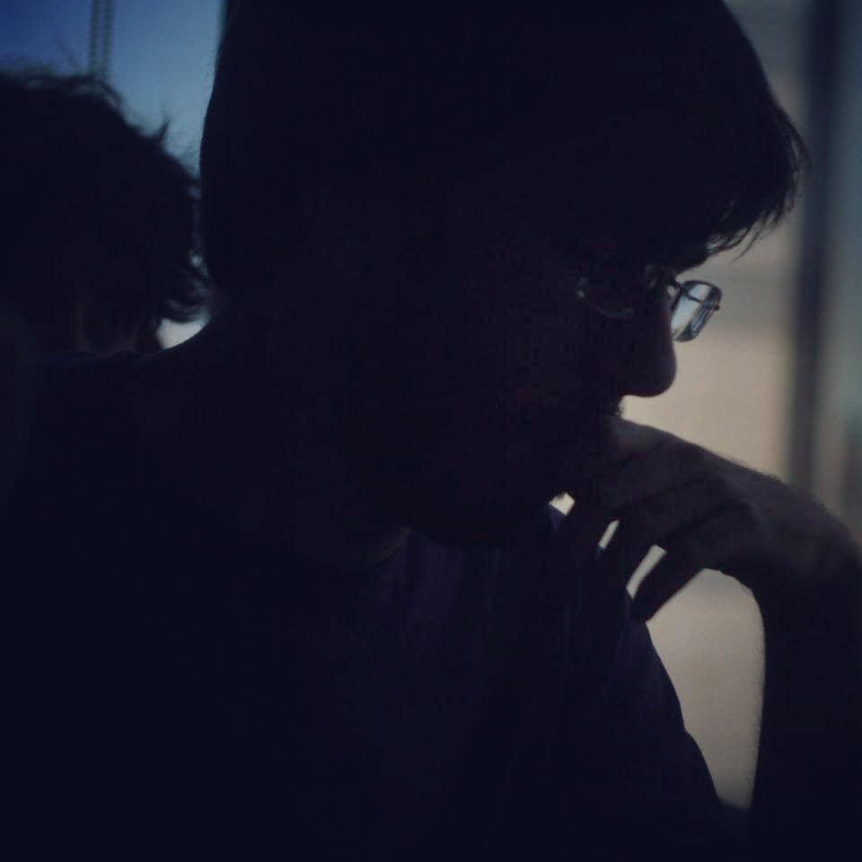

# _Hello, friend_

<table>
<tr>
<td valign="top">

- Senior full-stack engineer at [Vizit](https://www.vizit.com).
- Lecturer at [Universidad ORT Uruguay](https://www.ort.edu.uy), teaching compilers, formal languages, and data structures/algorithms.
- MSc. in Big Data/Artificial Intelligence from [ORT](https://www.ort.edu.uy), and in High Performance Computing from [Universidad de Santiago de Compostela](https://www.usc.gal), Spain.
- Occasional [game](https://globalgamejam.org/users/sebassu) [jam](https://v3.globalgamejam.org/users/sebassu) and Hacktoberfest/[Advent of Code](https://github.com/sebassu/advent-of-code) participant.
- Into fencing, piano, and video games. [Zachtronics](https://github.com/sebassu/zachtronics-solutions) enthusiast.   

            

</td>
<td width="325" valign="middle" align="center">
    
  
</td>
</tr>
</table>

  
  

<strong>Badges</strong>

 

  
  
  
  

  

